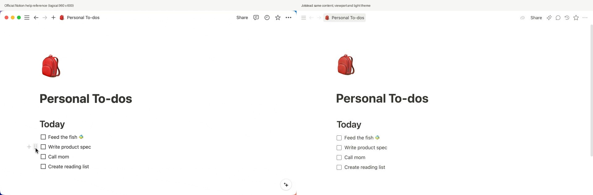
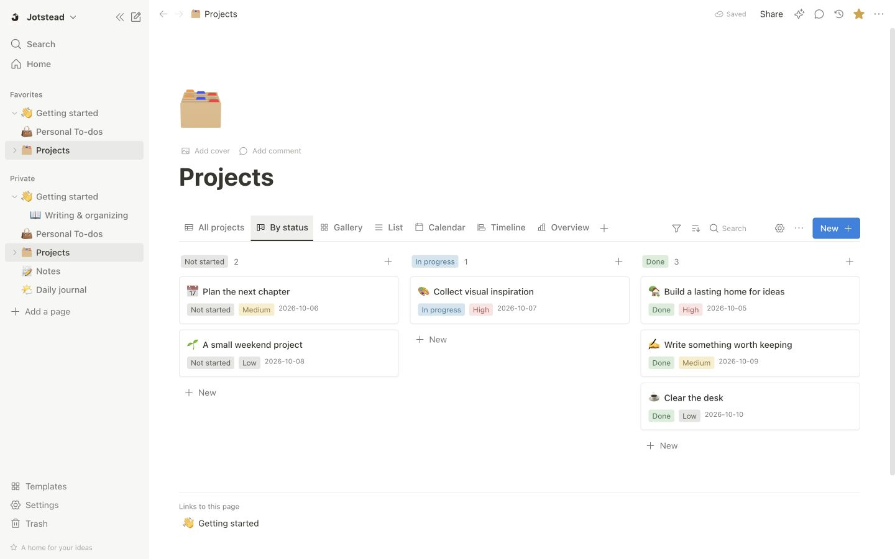
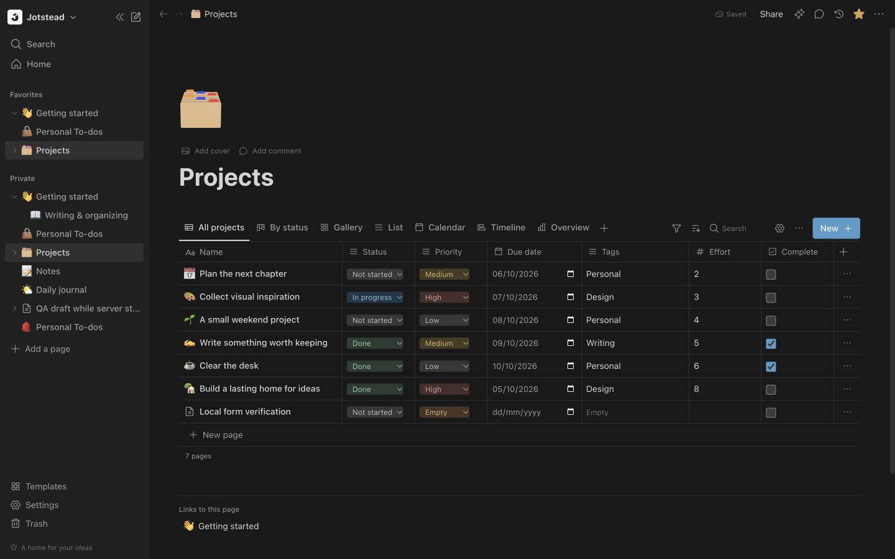
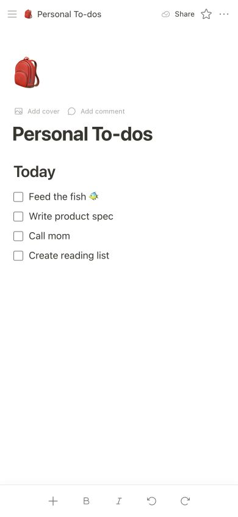
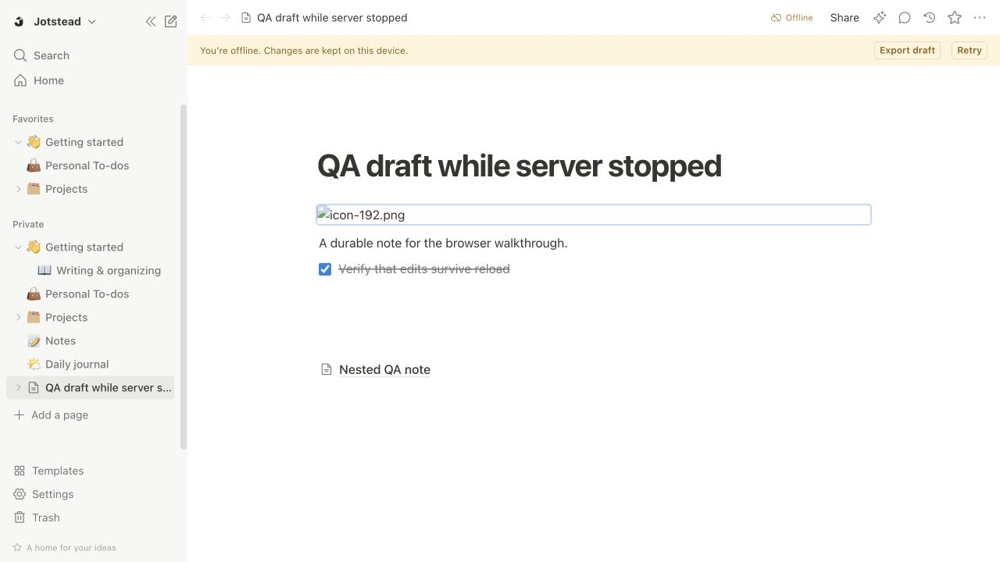

# Interface review — Jotstead 1.0

**Review verdict:** the implemented personal workspace passes its local visual/interaction review. Exact full Notion parity is not established. Public reference assets can differ from the current signed-in product; physical native app UI was not available for comparison.

## Sources and comparison setup

Captured 4 October 2026 from official Notion Help:

- [Intro to writing & editing](https://www.notion.com/help/writing-and-editing-basics): observed block-handle GIF, saved as `reference/block-menu.gif`; resting and menu frames extracted as `notion-editor.png` and `notion-block-menu.png`.
- [Database views, filters, sorts & groups](https://www.notion.com/help/views-filters-and-sorts): viewed layout image lightbox, captured as `reference/notion-database.jpg`.
- [Create your first page](https://www.notion.com/help/create-your-first-page): viewed mobile image lightbox, captured as `reference/notion-mobile.jpg`.

The editor source is 1728 × 1080 representing a 960 × 600 logical app viewport. It was downsampled by 1.8 for the side-by-side comparison. Jotstead used the same viewport, light theme, hidden sidebar, backpack icon, title, heading and four unchecked tasks. Both sources are visible together in `screenshots/editor-comparison.jpg`; no mismatch masking was applied. Native window controls remain present in the reference and absent in the web app. The reference frame shows a hovered task handle; the final app comparison is resting at scrollTop 0. Block actions were captured separately.

## Surfaces reviewed

| Surface | Assessment and correction | Evidence / remaining difference |
| --- | --- | --- |
| Typography | Matched 40 px title, 30 px heading and 16 px document body; corrected title tracking and title-to-heading spacing | Source uses its own font rasterization. App system font can vary on another OS |
| Layout/spacing | Matched compact 45 px toolbar, centered readable document, 240 px sidebar, task rows/checkbox scale; corrected icon/title positions using DOM measurements | Reference-only native window controls and extra app AI/save controls differ intentionally. Lists reorder as top-level groups rather than individual Notion task blocks |
| Color/effects | Warm near-black text, white page, subdued sidebar, light separators and muted status tags; dark theme inspected independently | Database calendar/selection controls use native browser fields. No matching dark reference was supplied, so dark review checks consistency/legibility rather than source equality |
| Imagery/icons | Standard Phosphor controls and editable emoji resemble the reference; original Jotstead mark is distinct and visible at favicon size | Branding is original. Generated icon is not a Notion logo. Emoji appearance depends on platform |
| Copy/data | Matched editor fixture content; all seven database views showed the same row data and real edits | Database reference has different fixture data and a broader layout editor, so its comparison is qualitative; not claimed as an exact state match |
| Menus/interactions | Slash selection, checkbox, modal actions, block movement/undo, tree keyboard actions, filters, comments/history, import error and conflict flow inspected | Full Notion menu catalog and native keyboard/drag behavior remain outside parity |
| Mobile | 390 × 844 editor/database captures; navigation overlay, scoped horizontal table scroll and touch formatting toolbar | Responsive PWA, not native iOS/Android UI. Physical keyboards/safe-area behavior still require device verification |

## Fixes made during the review

1. Slash-menu state updates now compare coordinates/query before scheduling a render.
2. Page action menus and selection toolbars attach within native dialogs when appropriate.
3. Sidebar row actions appear on keyboard focus, with accessible labels.
4. Added a skip link, visible focus treatment, reduced-motion handling, tabular numeric text and bounded table spans/widths.
5. Solid-color covers render correctly on database cards.
6. Editor icon placement, title tracking, title/heading gap and document gutter were corrected against the matched reference.
7. The mobile formatting toolbar is anchored to the viewport with safe-area padding and larger touch controls; row-modal toolbars stay in the modal.

All discovered blocking functional issues were fixed before the final captures. Remaining differences are listed above and in [FEATURES.md](FEATURES.md); no global percentage or pixel-perfect claim is made.

## Captures

Reference images are documentation-only comparisons, never application assets. The app's original branding and editable fixtures are independent of Notion's trademarks and media.
